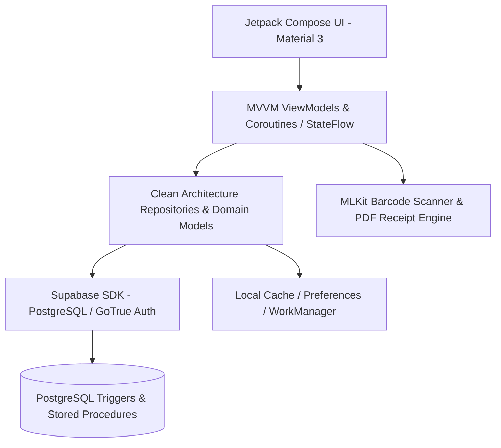
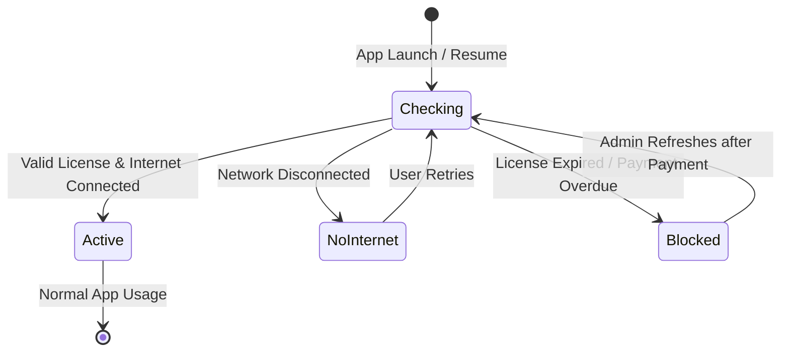

# FreshFood — Application Features & Behavior Specifications 🥬🥖📊

This document provides a comprehensive and exhaustive reference of all the **major features**, **system behaviors**, **business logic rules**, and **architecture specifications** implemented across the FreshFood Android application and its Supabase PostgreSQL backend.

---

## 📑 Table of Contents

1. [Executive Summary & Core Mission](#1-executive-summary--core-mission)
2. [Technical Architecture & Stack Overview](#2-technical-architecture--stack-overview)
3. [User Roles & Access Control (RBAC)](#3-user-roles--access-control-rbac)
4. [Module 1: Executive Dashboard & Analytics](#4-module-1-executive-dashboard--analytics)
5. [Module 2: Point of Sale (POS) & Checkout Engine](#5-module-2-point-of-sale-pos--checkout-engine)
6. [Module 3: Delivery Dispatch & Driver Workflow](#6-module-3-delivery-dispatch--driver-workflow)
7. [Module 4: Stock, Inventory & FEFO Batch Management](#7-module-4-stock-inventory--fefo-batch-management)
8. [Module 5: Returns, Adjustments & Physical Inventory Audits](#8-module-5-returns-adjustments--physical-inventory-audits)
9. [Module 6: Customer Credit & Debt Recovery System](#9-module-6-customer-credit--debt-recovery-system)
10. [Module 7: Purchase Entry & Supplier Stock Inflow](#10-module-7-purchase-entry--supplier-stock-inflow)
11. [Module 8: User & Staff Management](#11-module-8-user--staff-management)
12. [Module 9: Device Activation, Remote Licensing & Security](#12-module-9-device-activation-remote-licensing--security)
13. [Module 10: Multi-language Support & Custom Branding](#13-module-10-multi-language-support--custom-branding)
14. [Atomic Database Triggers & Backend Specifications](#14-atomic-database-triggers--backend-specifications)

---

## 1. Executive Summary & Core Mission

**FreshFood** is an enterprise-grade mobile Point of Sale (POS), Inventory Control, Delivery Tracking, and Customer Credit Management system built specifically for fresh food distributors, wholesalers, and retail businesses (e.g., dairy products, cheese, juices, bakery, cold meats, and packaged desserts).

### Key Value Propositions
- **Prevent Over-Selling & Spoilage**: Real-time stock alerts and First-Expired-First-Out (FEFO) batch tracking.
- **Accurate Doorstep Deliveries**: Delivery drivers can adjust quantities at the customer's doorstep, handle instant returns, and convert payment modes on the fly.
- **Debt & Credit Line Control**: Live credit limit enforcement, partial/full debt repayments, and detailed transaction audit logs.
- **Offline Resilience & Fast Sync**: Seamless operation with automatic background polling and offline fail-safes.
- **Remote Licensing Gate**: Centralized device activation and payment-gate lock for commercial SaaS distribution.

---

## 2. Technical Architecture & Stack Overview

### Core Technologies
- **Client**: Native Android with Kotlin, 100% Jetpack Compose (Material 3).
- **Architecture**: Clean Architecture + MVVM pattern with `StateFlow` and Kotlin Coroutines.
- **Backend / Database**: Supabase PostgreSQL, GoTrue Authentication, Row Level Security (RLS), and database trigger procedures.
- **Hardware Integration**: CameraX + Google ML Kit Barcode Scanning, PDF Document Generation (iText), Direct Telephony (`Intent.ACTION_DIAL`), and WhatsApp integration (`Intent.ACTION_VIEW`).
- **Background Tasks**: Android `WorkManager` + Coroutine Polling for new delivery notifications.

---

## 3. User Roles & Access Control (RBAC)

The application enforces strict role-based presentation and permission layers:

| Capability | Administrator (`ADMIN`) | Delivery Driver (`DELIVERY`) |
| :--- | :---: | :---: |
| **Executive Dashboard & Financials** | Full Access | ❌ Hidden |
| **Point of Sale (POS) / Sales Screen** | Full Access | ❌ Hidden |
| **Product Catalog & Price Management** | Full CRUD | ❌ Hidden |
| **Purchase Entries (Stock Inflow)** | Full Access | ❌ Hidden |
| **Customer Credit & Debt Payment** | Full Access | ❌ Hidden |
| **User & Staff Management** | Full Access | ❌ Hidden |
| **Store Branding ("Paramétrage")** | Full Access | ❌ Hidden |
| **Deliveries List & Execution** | All Drivers' Orders | Assigned Orders Only |
| **Doorstep Quantity Edits & Returns** | ✅ | ✅ |
| **Doorstep Cash / Credit Conversion** | ✅ | ✅ |
| **Language Switching** | ✅ | ✅ |

---

## 4. Module 1: Executive Dashboard & Analytics

### Big Features
- **Configurable Time Horizons**: Instant filtering by **Today (Day)**, **This Week**, **This Month**, and **All Time**.
- **Financial Metric Cards**:
  - **Total Revenue**: Aggregate sum of all validated sales within the selected range.
  - **Estimated Net Profit**: Dynamic profit calculation based on product margin averages:
    $$\text{Average Margin} = \frac{\text{Selling Price} - \text{Purchase Price}}{\text{Selling Price}}$$
  - **Total Outstanding Debt**: Live sum of all customer debts across the business.
  - **Low Stock / Out of Stock Counters**: Immediate count of products needing urgent replenishment.
- **Trend & Growth Indicators**: Real-time percentage comparison against the previous matching timeframe (e.g., today vs. yesterday, this week vs. last week).
- **Delivery Activity Tracker**: Today's delivery volume broken down into total, pending, and completed deliveries.
- **Interactive Drill-Down Sheets**:
  - Clicking any card opens a bottom modal sheet with itemized lists (e.g., list of debtors, detailed sales breakdown, low-stock inventory list).

---

## 5. Module 2: Point of Sale (POS) & Checkout Engine

### Big Features
- **High-Speed Product Selection & Search**:
  - Instant textual search by product name, brand, or SKU.
  - Fast category filtering chips with dynamic emoji visual identifiers.
  - One-tap ML Kit Barcode Scanner from top bar or floating action.
- **Cart Management & Stock Guard**:
  - Increment, decrement, and direct numerical quantity input.
  - **Anti-Overbooking Guard**: Quantity cannot exceed `product.current_stock`.
  - Zero-stock items are visually flagged and locked against addition.
- **Customer Selection & Debt Warning**:
  - Searchable customer dropdown.
  - Displays customer's current credit balance and authorized credit limit.
- **Dual Payment Methods**:
  - **Espèces (Cash)**: Full payment captured, zero impact on customer debt.
  - **À Crédit (Customer Credit)**: Validated against customer's credit limit; increases customer debt.
- **Direct Dispatch Creation**:
  - Toggle to convert the sale into an assigned delivery order (`create_delivery = true`).
  - Dropdown selector for available drivers fetched dynamically from user profiles.
- **Professional PDF Receipt Engine**:
  - Dynamic store branding (Store Name, Tagline, Address, Phone).
  - Itemized table with quantities, unit prices, and subtotals.
  - Customer information and previous vs. new debt balance snapshot.
  - 1-Click action to **Print**, **Open PDF**, or **Share directly via WhatsApp**.

---

## 6. Module 3: Delivery Dispatch & Driver Workflow

### Big Features
- **Live Dispatch Pipeline**:
  - Orders classified by status: `PENDING`, `ASSIGNED`, `IN_TRANSIT`, `DELIVERED`, `CANCELLED`.
  - Drivers only see tasks assigned to them; Admins see the enterprise fleet.
- **Real-Time Notification & Polling**:
  - Background polling worker checks for newly assigned orders every 15 seconds.
  - High-priority Android heads-up notification with deep-link navigation directly to order details.
- **Doorstep Quantity Adjustment & Return Handling**:
  - When customer accepts fewer items (e.g., ordered 4, accepts 2):
    - Driver decrements quantity directly on the mobile app.
    - System calculates differences and prepares atomic stock return.
- **Doorstep Payment Method Switching**:
  - Drivers can switch payment mode between **CASH** and **CREDIT** at customer request prior to delivery completion.
- **Direct Customer Communications**:
  - 1-Click telephone dialer.
  - 1-Click WhatsApp chat launch with pre-filled delivery message.
- **Atomic Delivery Finalization**:
  - Finalizes order status to `DELIVERED`.
  - Automatically updates database records, stock batches, invoice totals, and credit ledgers.

---

## 7. Module 4: Stock, Inventory & FEFO Batch Management

### Big Features
- **Real-Time Stock Catalog**:
  - Displays product images, current stock, retail prices, wholesale prices, and purchase costs.
  - Visual status chips:
    - 🔴 **Rupture (Out of Stock)**: Quantity $\le 0$.
    - 🟠 **Faible (Low Stock)**: Quantity $\le \text{min\_stock\_alert}$.
    - 🟢 **En Stock (Healthy)**: Normal inventory level.
- **FEFO (First Expired, First Out) Multi-Batch Tracking**:
  - Products track multiple expiration batches in `stock_batches`.
  - POS sales and deliveries deduct automatically from the earliest expiring batch first.
- **Product Creation & Editing**:
  - Barcode assignment with live scanner integration.
  - Category, Brand, Unit of Measure (KG, Liter, Unit, Box, etc.).
  - Image capture and Supabase Storage upload.

---

## 8. Module 5: Returns, Adjustments & Physical Inventory Audits

### Big Features
- **Customer & Supplier Returns Workflow (`ReturnsScreen`)**:
  - Dedicated return order logging for damaged or returned goods.
  - Automatically restores inventory levels and logs `DELIVERY_RETURN` or `CUSTOMER_RETURN` stock movements.
- **Physical Inventory Auditing (`PhysicalInventoryScreen`)**:
  - Create and manage physical stock count sessions (`OPEN` vs `CLOSED`).
  - Compare theoretical database inventory against actual counted stock on shelves.
  - Calculate variance and generate adjustment stock movements.

---

## 9. Module 6: Customer Credit & Debt Recovery System

### Big Features
- **Customer Directory & Credit Profiles**:
  - Customer name, phone number, address, customer type (Retail / Wholesale).
  - Current debt balance (`current_credit`) vs authorized limit (`credit_limit`).
- **Detailed Debt Audit Trail (`CustomerCreditDetail`)**:
  - Complete history of invoices on credit, delivered item summaries, and timestamps.
- **Fast Debt Collection Modal**:
  - Record partial or full cash debt payments.
  - **Optimistic UI Update**: Instantly deducts credit on screen for zero-latency user feedback.
  - Inserts payment receipt into `payments` table and triggers automatic debt re-calculation.
- **Contact Shortcuts**:
  - Call customer directly from the profile card.
  - Send balance reminders via WhatsApp.

---

## 10. Module 7: Purchase Entry & Supplier Stock Inflow

### Big Features
- **Supplier Invoice / Stock Intake Logging (`PurchaseEntryScreen`)**:
  - Select product, quantity received, unit purchase cost, and target retail selling price.
  - Input lot number and expiration date.
- **Automated Lot Batch Creation**:
  - Increases `products.current_stock`.
  - Creates a new entry in `stock_batches` with the expiration date for FEFO sorting.
  - Creates an audit entry in `stock_movements` with type `PURCHASE`.
  - Updates the product's default purchase price and profit margins.

---

## 11. Module 8: User & Staff Management

### Big Features
- **Staff Provisioning (`UserManagementScreen`)**:
  - Admin can create new staff accounts with email, password, first name, last name, and role.
  - Supports role assignment: `ADMIN`, `DELIVERY`, `CASHIER`.
- **Driver Management**:
  - List and edit delivery drivers.
  - Assign drivers to active orders.

---

## 12. Module 9: Device Activation, Remote Licensing & Security

### Big Features
- **Persistent Session & Seamless Background Token Refresh**:
  - Automatically loads and preserves authentication sessions across app launches and restarts.
  - Automatically refreshes expired JWT tokens using Supabase refresh tokens so the user stays continuously logged in until they explicitly click **Logout** (Déconnexion).
- **Activation Gate (`ActivationGate`)**:
  - Checks remote license status on launch and every time app returns to foreground.
- **Payment-Gate Screen (`PaymentRequiredScreen`)**:
  - Displayed if software subscription is unpaid or remote kill-switch is triggered in Supabase.
  - Displays localized billing advisory and quick call button to software developer/support.
- **No-Internet Fail-safe (`NoInternetScreen`)**:
  - Clean error interface with one-tap reconnect button.

---

## 13. Module 10: Multi-language Support & Custom Branding

### Big Features
- **Trilingual Localization**:
  - **Français (French)**: Default commercial language.
  - **العربية (Arabic)**: Native Arabic typography with full Right-to-Left (RTL) layout support.
  - **English**: International standard support.
  - Dynamic language selector dialog with instant activity recreate without app restart.
- **Dynamic White-Label Branding ("Paramétrage")**:
  - Admin can update **Store Name / Nom Commercial** and **Tagline / Description**.
  - Synchronized across Supabase and automatically applied to:
    - Navigation Drawer Header.
    - Application Top Bars.
    - PDF Invoices and Customer Receipts.

---

## 14. Atomic Database Triggers & Backend Specifications

The FreshFood PostgreSQL backend utilizes stored procedures and transactional triggers to guarantee financial and inventory integrity:

### The Delivery Finalization Transaction
When a delivery is completed or edited:
1. **Delta Calculation**:
   $$\Delta Q = Q_{\text{original}} - Q_{\text{delivered}}$$
2. **Stock Reintegration**:
   - If $\Delta Q > 0$ (Items returned): $+ \Delta Q$ returned to stock & batch lots (`movement_type = 'DELIVERY_RETURN'`).
   - If $\Delta Q < 0$ (Items added): $- |\Delta Q|$ deducted via FEFO (`movement_type = 'DELIVERY'`).
3. **Invoice Reconciliation**:
   - `sale_items` and `delivery_items` updated with final delivered quantities.
   - `sales.total_amount` recalculated strictly on delivered items.
4. **Financial Settlement**:
   - **For CREDIT**: `sales.credit_amount` updated, `credit_transactions` (type `DEBT`) updated, customer's `current_credit` adjusted.
   - **For CASH**: `sales.paid_amount` updated, `payments` updated, zero debt registered.
   - **For Method Switch (CASH ➔ CREDIT)**: Cash payment voided, debt record created.
5. **Status Update**: `delivery_orders.status` set to `'DELIVERED'`.

---
*Document generated for the FreshFood project codebase.*
